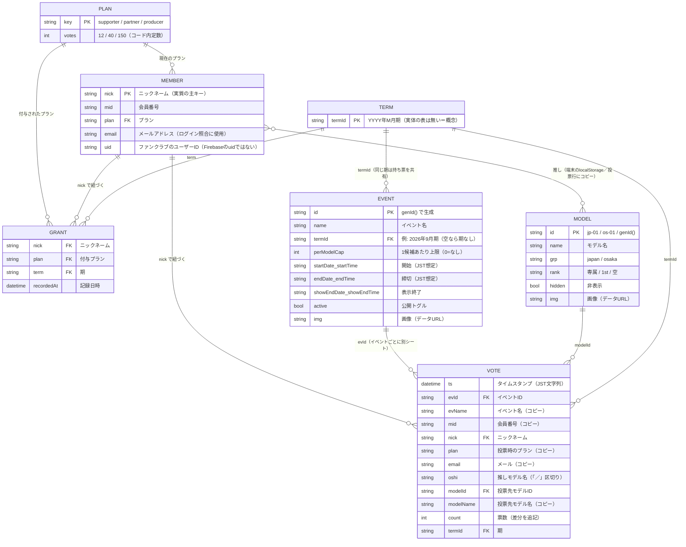

# iito members 投票 ― ER図（データの設計図）

> 作成日: 2026-09-27（JST）
> 根拠: `index.html`（3087行）と `gas/iito_gas_api.gs`（679行）を実際に読んで作成。
> 「推測：」と書いた項目はコードからの推測。

## 1. 全体図

データは3か所に分かれて保存されている。

| 置き場所 | 中身 | 正（マスター）か |
|---|---|---|
| Googleスプレッドシート（GAS経由） | 会員・イベント・モデル・投票記録・プラン付与履歴 | **正** |
| 各端末のlocalStorage | 上記のコピー（キャッシュ）＋推し・ログイン状態・管理PW | コピー（推しだけは端末にしか無い） |
| Firebase Authentication | メールリンクでログインしたメールアドレス | ログイン確認のみ（会員データとはつながっていない） |

> 図の見方: `||--o{` は「1対多」。例えば「1人の会員(MEMBER)は、たくさんの投票行(VOTE)を持つ」。
> 例えるなら、MEMBERは「会員証」、VOTEは「投票用紙の控え」、GRANTは「毎月の配給記録」。

## 2. 各表の保存場所と形

| ER図の名前 | スプレッドシートのシート名 | 形 | 書く処理（GAS action） | 読む処理 |
|---|---|---|---|---|
| MEMBER | `会員データ` | 1行1会員（A〜E列） | `saveMembers`（**全消し→全書き**） | `getMembers` |
| EVENT | `イベント` | 全イベントを**JSON1本**にして4万字ごとに分割 | `saveEvents`（全体上書き） | `getEvents` |
| MODEL | `モデル` | `{japan:[…], osaka:[…]}` を**JSON1本**で分割保存 | `saveModels`（全体上書き） | `getModels` |
| VOTE | `投票_<evId>`（**イベントごとに1シート**） | 1行目=タイトル、2行目=見出し、3行目〜データ（A〜L列） | `saveVote`（追記のみ） | `getResults` / `getTermPlans` / `getOshi` |
| GRANT | `プラン付与履歴` | 1行1付与（A〜D列）。`nick\|plan\|term` の重複は記録しない | `recordGrants` | `getGrants` |
| PLAN | （シート無し） | コード内定数 `PLANS`（HTML）／`PLAN_VOTES`（GAS） | ― | ― |
| TERM | （シート無し） | 文字列 `YYYY年M月期` | ― | ― |
| （未使用） | `投票データ` | 定数 `SHEET_VOTES` だけ定義。現在どこからも使われていない | ― | ― |

## 3. つながり方の注意（バグの元になりやすい点）

1. **会員の主キーがニックネーム**
   - VOTE・GRANT・推し・セッションは、すべて `nick`（文字列）でつながっている。`mid`（会員番号）ではない。
   - そのため、会員がニックネームを変えると、過去の投票・付与履歴・繰越がすべて別人扱いになる（推測：ファンクラブ側で変更があるとCSV取り込み後に起きる）。
2. **VOTE は「差分の追記」**
   - 同じ人が同じモデルに2回送ると、2行になる。合計は常に「行の合計」で計算する。
   - 行を手で消したり編集したりすると、持ち票の計算が変わる。
3. **EVENT を消しても VOTE シートは残る**
   - GAS側は `投票_` で始まる全シートを数える。一方、画面側は **今あるイベント一覧に載っているイベントだけ** を数える。
   - そのため、イベントを削除すると「画面の残り票」と「GASの上限判定」がずれる（引き継ぎ資料 `docs/handoff.md` の 4章）。
4. **MEMBER は Firebase のユーザーとつながっていない**
   - Firebaseは「そのメールを持っている人か」を確かめるだけ。
   - 「どの会員か」は、ログイン前に選んだニックネーム（`iito_pending_nick`）で決まる。
5. **推し（MEMBER ↔ MODEL）は正式な表が無い**
   - 端末のlocalStorage（`iito_o_v2`）にだけ保存される。
   - 投票したときに、VOTE の `oshi` 列へ「モデル名」でコピーされる（IDではなく名前）。
   - そのため、モデル名を変えると過去の推し表示は古い名前のまま残る。
6. **EVENT / MODEL は「全体を丸ごと上書き」**
   - 2台の端末で同時に管理画面を編集すると、後から保存した方が勝つ。先に保存した方の変更は消える。
